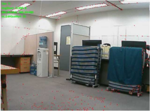
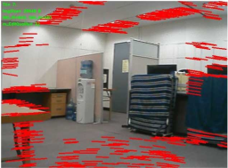
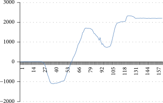

# Monocular Movement
This is my 3rd year project in which I attempt to create a micro-quadcopter that is capable of stable
flight with a single camera as its only sensory input. The aim is to produce the foundation of a
device that use as little power as possible for flight. 

### Development Process
I will develop this project in 2 stages the first being an implementation on a ground vehicle, the
second being on an aerial vehicle.

The algorithm will use a combination of SLAM, object avoidence and optical flow to achieve its goal.

#### Our starting pose

#### Our optical flow analysis

### Useful links for development
 - [Optical flow avoidance](https://www.youtube.com/watch?v=pAI_ZJOD7zQ)
 - [Gazebo Simulator](https://blog.generationrobots.com/en/robotic-simulation-scenarios-with-gazebo-and-ros/)
 - [Paper on optical flow](https://www.hindawi.com/journals/misy/2016/8937176/)
 - [Paper on control of a quadcopter with reinforcement learning](https://arxiv.org/pdf/1707.05110.pdf)
 - [Reinforcement contro git repo](https://github.com/udacity/RL-Quadcopter)
